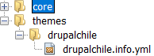
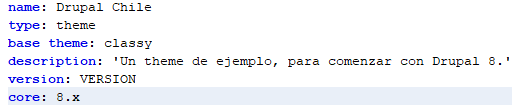
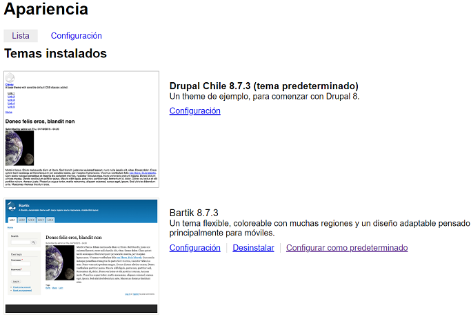

# 1. Introducción
Este curso está pensado para personas que ya tienen conocimientos mínimos acerca
de cómo instalar un sitio de Drupal 8.

## 1.1. Prerrequisitos
Sitio Drupal 8 instalado

## 1.2. Comenzar
Hacer un theme "mínimo" es sencillo. Es necesario meterse dentro de la carpeta 
"themes" que está al mismo nivel que la carpeta "core".  

1. Hacer una carpeta con el nombre del theme. Por ejemplo "drupalchile".  
2. Hacer un archivo de extensión ".info.yml" con el nombre del theme. por 
ejemplo "drupalchile.info.yml"  
3. Ingresar datos mínimos en el archivo ".info.yml"  
  
---

_figura 1: estructura de carpetas_  
  
  
---

_figura2: contenido del archivo drupalchile.info.yml_  
  

---
  
Tan sólo haciendo lo anterior ya podemos seleccionar el theme del listado de 
themes. Para ello hay que ir a la opción "Apariencia" y activar el theme 
DrupalChile.

---
  
_figura 3: listado de themes_  
  

---

## 1.3. Explicación del .info
El archivo `.info` que se acaba de construir, es un archivo `yml` y por lo tanto
 se representa como un arreglo internamente para `PHP`.  
Los atributos del archivo recién escrito, son los siguientes:  

### name: Drupal Chile
Es el nombre del theme, como se mostrará el la interfaz

### **type:** theme
### **base theme:** classy
### **description:** 'Un theme de ejemplo, para comenzar con Drupal 8.'
### **version:** VERSION
### **core:** 8.x 
